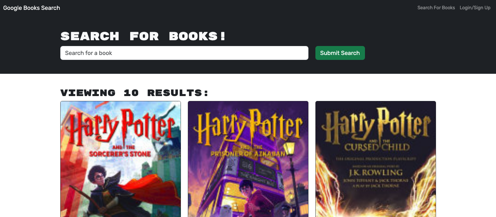

# Google Book Search
[Google Book Search](https://book-search-engine-whc8.onrender.com)

# Table of Contents
1. [Description](#Description)
2. [Installation](#installation)
3. [Usage](#tusage)
4. [License](#license)
5. [Contributors](#contributors)
6. [Testing](#testing)
7. [Questions](#questions)

## Description
This app lets you search and save books from the Google Books API.

## Installation
NA

## Usage
This app is lets users search for relevant books based on title, save selections, see all saved books, and delete books from their collection. 

## License
This is a Apache License 2.0 

## Contributors
@kylezap

## Testing
NA

